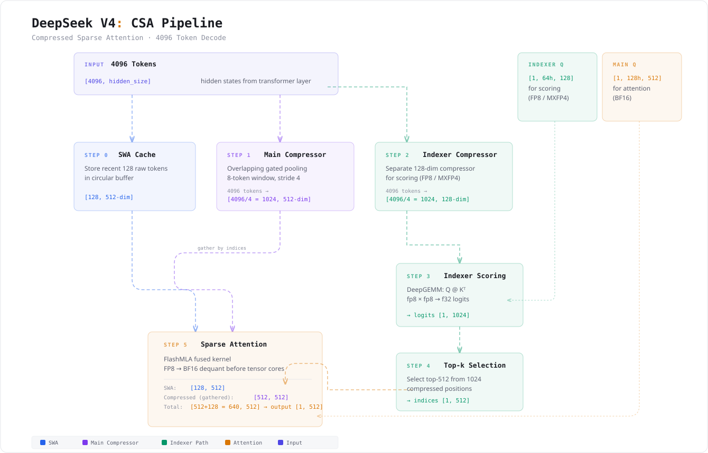

# DeepSeek V4 Tutorial

Study and run DeepSeek V4 (Flash) on consumer GPUs (8× RTX 5090 D).

```bash
I'm DeepSeek 👋
>>> The capital of France is
The capital of France is Paris.<｜end▁of▁sentence｜>
```

## More Analysis
### KV Cache
- [DeepSeek V4 KV Design](./docs/ds_v4_kv.md)



### Others
- [Run DeepSeek V4 Flash on consumer GPUs](./docs/run_ds_flash.md)
- [DeepSeek V4: Pro vs Flash Architecture Comparison](./docs/v4_pro_vs_flash_arch_and_kvcache.md)
- [DeepSeek V4 KV Cache Primitives(SW/Token Compression/Indexer)](./docs/kv_cache_analysis.md)


### Architecture Walkthrough (tiny model)

Run the full model with random weights to trace tensor shapes through all components:

```bash
python walkthrough.py
```

This exercises all V4-specific components: SWA-only, C4A (compressor+indexer), C128A, MoE, Hyper-Connections.


